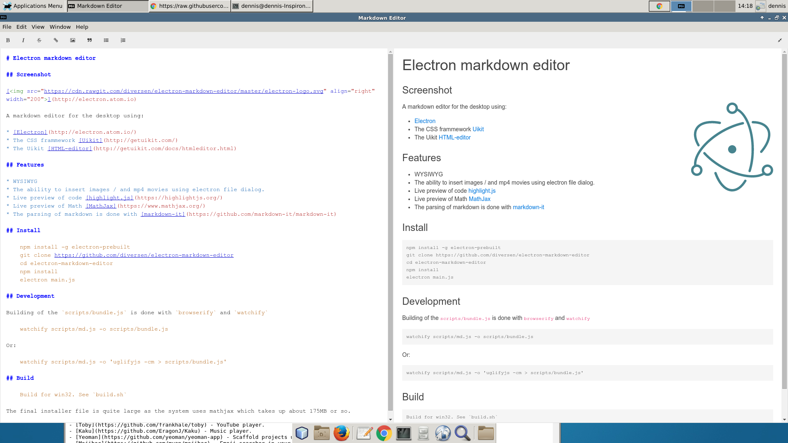

# Electron markdown editor

## Screenshot

A markdown editor for the desktop using:

* [Electron](http://electron.atom.io/)
* The CSS frammework [Uikit](http://getuikit.com/) 
* The Uikit [HTML-editor](http://getuikit.com/docs/htmleditor.html)

## Features

* WYSIWYG
* The ability to insert images / and mp4 movies using electron file dialog. 
* Live preview of code [highlight.js](https://highlightjs.org/)
* Live preview of Math [MathJax](https://www.mathjax.org/)
* The parsing of markdown is done with [markdown-it](https://github.com/markdown-it/markdown-it) 

## Install

From npm

    // Global
    sudo npm install electron-markdown-editor -g

    // Development    
    sudo npm install electron-prebuilt -g
    git clone https://github.com/diversen/electron-markdown-editor
    cd electron-markdown-editor 
    npm install
    electron app.js

## Development

Building of the `scripts/bundle.js` is done with `browserify` and `watchify`

    watchify scripts/md.js -o scripts/bundle.js

Or: 

    watchify scripts/md.js -o 'uglifyjs -cm > scripts/bundle.js'

## Build

    Build for win32. See `build.sh`

The final installer file is quite large as the system uses mathjax which takes up about 175MB or so.

## Notes

About creating a npm bin file, when doing `npm install electron-markdown-editor -g`. 

http://blog.soulserv.net/building-a-package-featuring-electron-as-a-stand-alone-application/
